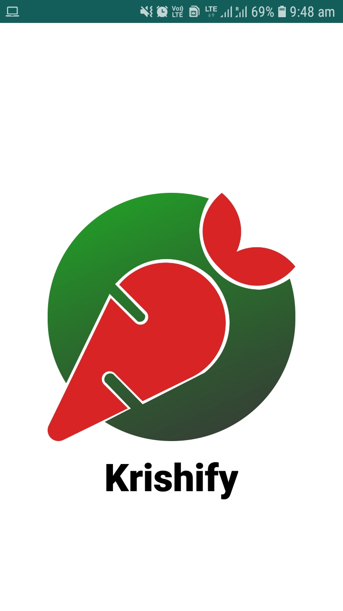
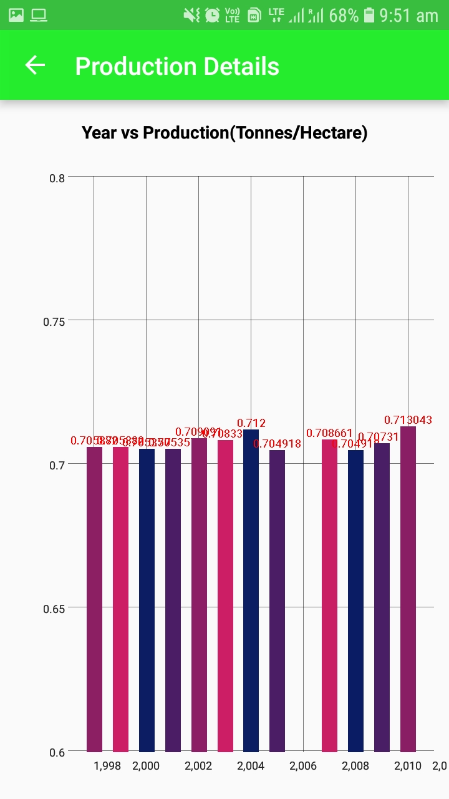

This app is made for HackVsit

# Demo 
[demo](https://www.figma.com/proto/rnffOmLFSsGM2aNhulQNGf/Hack-VSIT-Krishify?node-id=3%3A15&viewport=-2995%2C-4168%2C1.9215978384017944&scaling=scale-down)
 

# Screenshots 

